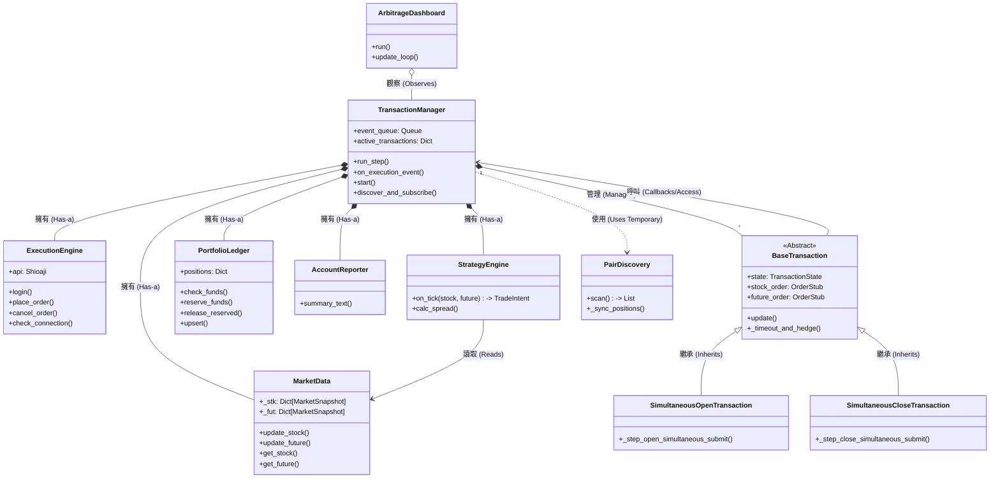
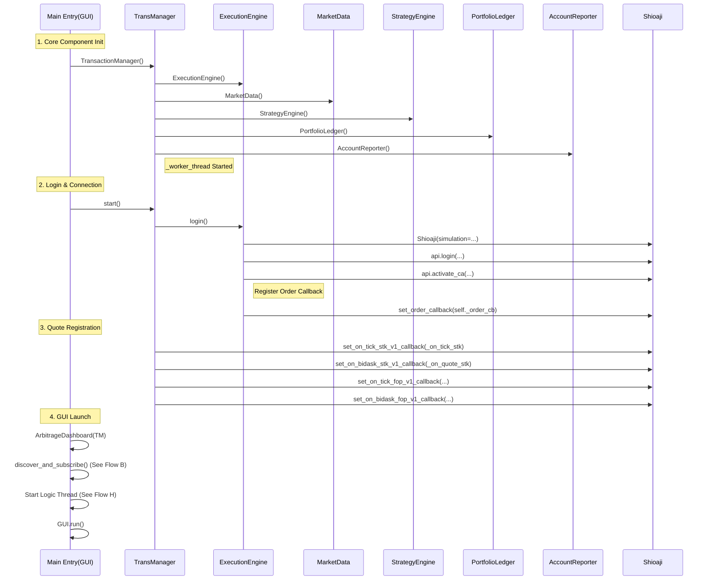
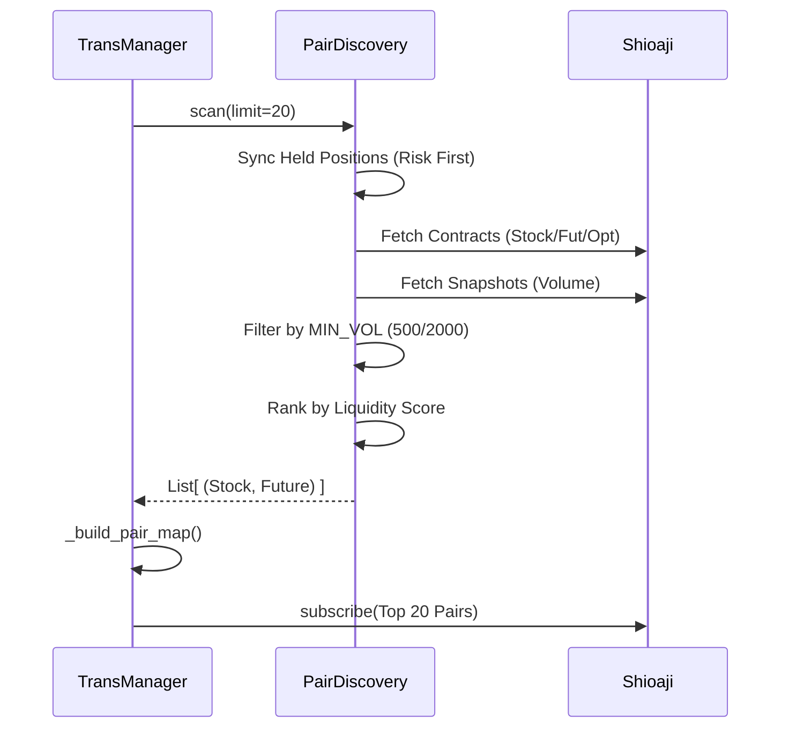
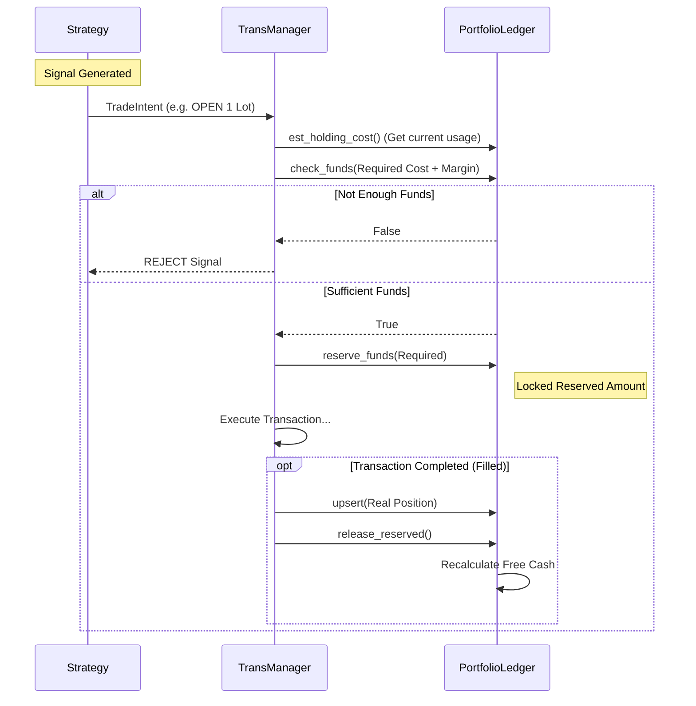
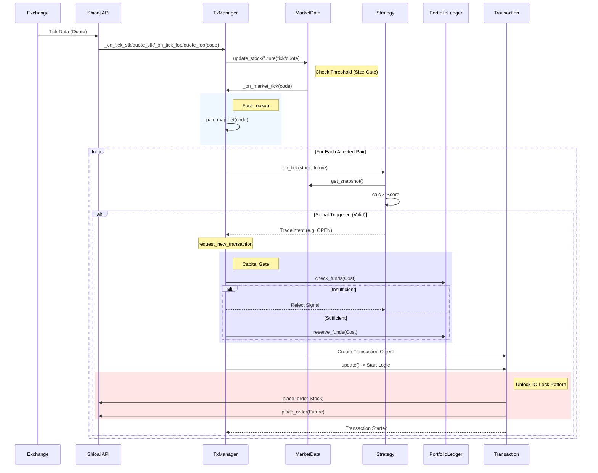
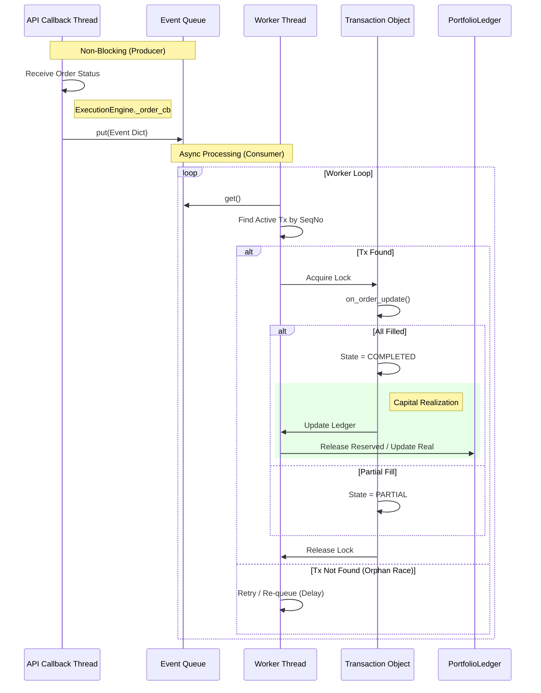
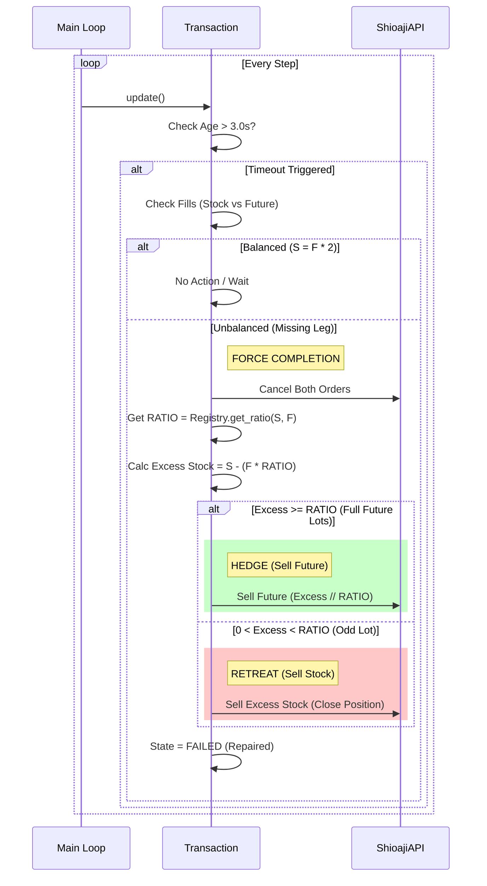
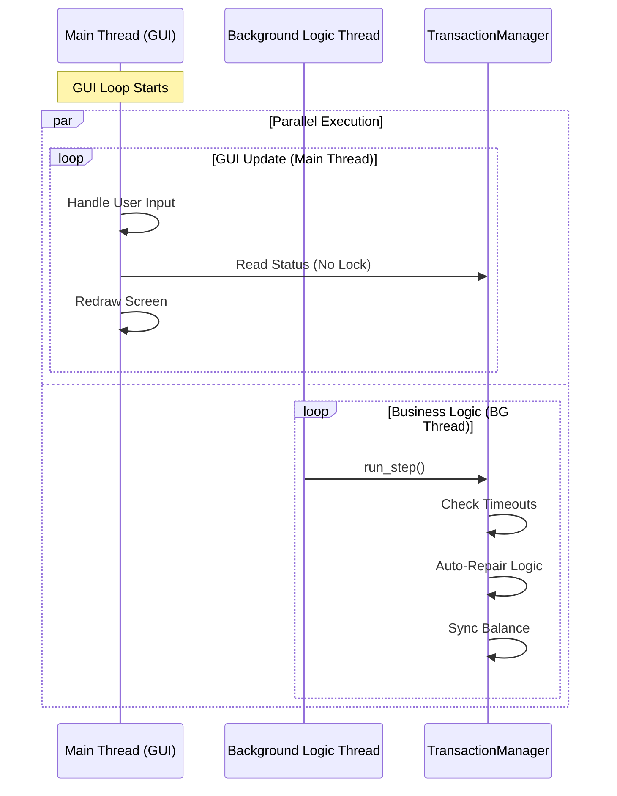
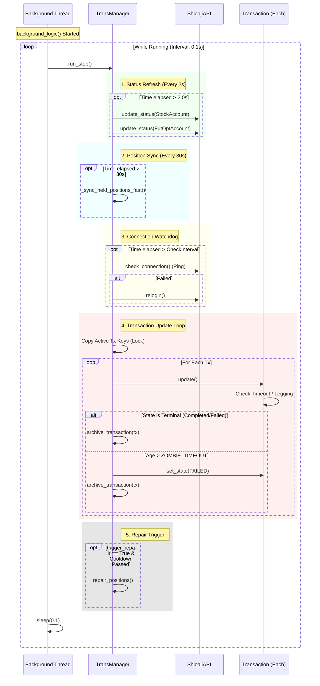

# Source Code Interpretation: arbitrage_vb06.py

這份文件是對 `arbitrage_vb06.py` 原始碼的深度解讀，幫助你理解各個模組的功能與互動方式。

## 1. 核心架構 (System Architecture)

程式碼結構採用 **Layered Architecture (分層架構)**，由下而上分別是：

1.  **Driver Layer**: `ExecutionEngine` (負責與 Shioaji API 溝通)
2.  **Data Layer**: `MarketData` (負責維護行情報價快照)
3.  **Strategy Layer**: `StrategyEngine` (純邏輯運算，計算價差與訊號，包含配對邏輯)
4.  **Orchestration Layer**: `TransactionManager` (總指揮，協調資金、策略、交易與回報)
5.  **State Layer**: `BaseTransaction` 及其子類 (負責單筆交易的生命週期管理)
6.  **Presentation Layer**: `ArbitrageDashboard` (GUI) / `AccountReporter` (Console)
7.  **Discovery Layer**: `PairDiscovery` (負責系統啟動時的掃描與配對)

---

## 2. 重要類別詳解 (Key Classes)

### A. SystemConfig (設定檔)
*   **用途**: 集中管理所有靜態常數 (Timeout 秒數、冷卻時間、Lot Size 等)。
*   **關鍵參數**: 
    *   `ZOMBIE_TIMEOUT`: 交易卡死多久後強制清除。
    *   `REPAIR_COOLDOWN`: 觸發修復後要冷靜多久。

### H. InstrumentRegistry (商品註冊表) - **[New!]**
*   **用途**: 集中管理所有商品的合約規格與單位換算，確保全系統單位統一。
*   **關鍵變數**:
    *   `_specs`: 字典結構 `{code: {'type': 'Stock'|'Future', 'multiplier': int}}`。
        *   **Stock**: `multiplier` 通常為 1000 (股)。
        *   **Future**: `multiplier` 為合約乘數 (例如台指期 200, 個股期 2000)。
*   **功能**:
    *   `get_ratio(stock, future)`: 動態計算避險比例。例如 `Fut(2000) / Stk(1000) = 2.0`。
    *   確保系統能支援各種不同規格的商品 (如不同倍數的個股期)，而不需要硬編碼。

### B. MarketData (行情資料庫)
*   **用途**: Thread-safe 的行情快照儲存。
*   **特點**:
    *   **Locking**: 寫入時用 `_lock` 保護，確保 snapshot 不會讀到一半的數據。
    *   **Optimization (優化)**: `get_stock` 在讀取時**不鎖** (No Lock)，這是為了讓 GUI 繪圖極快，犧牲一點點微觀的一致性換取效能。
    *   **Size Gate (新功能)**: 在 `update` 時，會檢查掛單量是否「跨越門檻」。只有當流動性從不足變充足時，才觸發策略。

### C. ExecutionEngine (執行引擎)
*   **用途**: 包裝 Shioaji API，處理登入、憑證、帳號選取。
*   **關鍵**:
    *   `_order_cb`: API 的回調入口。這裡**禁止執行複雜邏輯**，只負責把資料打包，然後透過 Callback 傳給上層。
    *   `_lock`: 保護內部的 `_order_cache`，確保 Polling 和 Callback 不會打架。

### D. TransactionManager (總指揮)
*   **用途**: 系統的心臟。
*   **關鍵成員**:
    *   `event_queue`: **[新!]** Producer-Consumer 模式核心。
    *   `_worker_thread`: 背景執行緒，消化事件並更新狀態。
    *   `active_transactions`: 存放進行中的交易。
    *   `ledger`: 資金庫 (`PortfolioLedger`)。
    *   `reporter`: 負責產生報告文字 (`AccountReporter`)。
*   **關鍵流程**:
    *   `run_step()`: Main Loop 每秒呼叫。
    *   `_on_market_tick()`: 報價驅動策略。

### E. PortfolioLedger (資金/庫存帳本)
*   **用途**: 本地端的資金管理 (Capital Management)。
*   **功能**:
    *   `cash_total`: 總現金 (來自 API Sync + 本地估算)。
    *   `reserved_stock`/`reserved_margin`: 圈存資金 (交易發出但未成交)。
    *   `est_holding_cost()`: 計算目前部位佔用的資金與保證金。

### F. AccountReporter / ArbitrageDashboard (報告與介面)
*   **AccountReporter**: 簡單的 Text Formatter，負責把部位狀態轉成字串供 Console 或 Log 使用。
*   **ArbitrageDashboard**: (Tkinter) 負責圖形化介面。
    *   **Threading**: 運行在 Main Thread。業務邏輯 (`TransactionManager`) 則被移到 Background Thread 避免卡住介面。

### G. PairDiscovery (配對掃描器)
*   **用途**: 負責在系統啟動時掃描並建立監控清單 (`monitored_pairs`)。
*   **流程**:
    1.  **Sync**: 取得現有庫存 (優先監控)。
    2.  **Filter**: 篩選出成交易量大於門檻 (`MIN_STOCK_VOL`/`MIN_FUTURE_VOL`) 的標的。
    3.  **Rank**: 依照「股票量+期權量」總分排序。
    4.  **Select**: 選取前 N 名 (Top 20) 回傳給 Manager 進行訂閱。

---

## 3. 類別關係圖 (Class Diagram)

---

## 4. 關鍵調用流程 (Key Call Flows)

### A. 系統啟動與註冊流程 (System Startup & Registration)
完整展示所有元件的初始化順序 (`__init__`) 以及 API 相關的註冊點。

### B. 配對掃描與訂閱流程 (Pair Discovery)
`discover_and_subscribe` 的內部細節。

### C. 資金控管流程 (Capital Control)
`PortfolioLedger` 的生命週期：Check -> Reserve -> Realize。

### D. 行情觸發與下單流程 (Synchronous Tick-to-Order) - **Deep Dive**
最核心的策略觸發路徑，包含 **Fast Lookup**, **Capital Gate**, **Unlock-IO-Lock** 等所有細節。

### E. 回報處理流程 (Asynchronous Callback Loop) - **Deep Dive**
完全非同步的狀態更新路徑，包含 **Orphan Race** 重試與 **Capital Realization**。

### F. 缺腳與救援流程 (Legging Risk / Failover Logic)
當一腳成交一腳未成交 (超時) 時的救援邏輯。這是 `BaseTransaction._timeout_and_hedge` 的具體實作。
**避險比例 (RATIO) 由 `InstrumentRegistry` 動態提供 (例如 1 Future = 2 Stocks)。**

### G. GUI 與背景邏輯模型 (Threading Model)

---

### H. 背景邏輯與 Run Step 細節 (Background Logic & RunStep Detail) - **New Request**
這是系統的「心跳」循環，由 `main.py` 中的 `background_logic` 驅動，每 0.1 秒跳一次。

---

## 5. 總結
1.  **分層明確**：GUI / Logic / Data / Driver 各司其職。
2.  **執行緒安全**：GUI 讀取與 Logic 寫入透過 `_lock` 或 Copy 保護。
3.  **完整生命週期**: 從 Startup -> Discovery -> Capital Check -> Order Execution -> Callback Update -> Termination/Failover.
